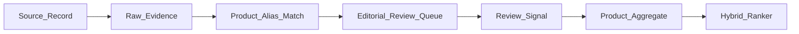

# Review ingestion model

The production system stores third-party evidence as **metadata and derived signals**, not as copied forum databases.

## Entities

Types are defined in [src/lib/types/evidence.ts](../src/lib/types/evidence.ts).

| Entity | Purpose |
|--------|---------|
| `SourceRecord` | Platform, rights status, allowed use, crawl method, and notes. |
| `RawEvidence` | URL-level evidence metadata, product IDs, language, timestamp, excerpt hash. |
| `ReviewSignal` | Human-reviewed theme/sentiment/confidence extracted from permitted evidence. |
| `ProductAggregate` | Product-level rollups: durability, stiffness, speed, comfort, confidence. |
| `ProductAlias` | Brand/model aliases for English/Chinese/Japanese/Korean matching. |
| `FirstPartyReview` | Consented user reviews submitted through IntoBadminton. |

## Pipeline

## Rules

- No source can enter the pipeline unless `rightsStatus` is known.
- `permission_required`, `manual_citation_only`, and `unknown` sources must not be bulk ingested into production recommendations.
- Multilingual summaries must retain original language and source URL.
- Any model-generated signal must be human-reviewed before affecting product confidence.
